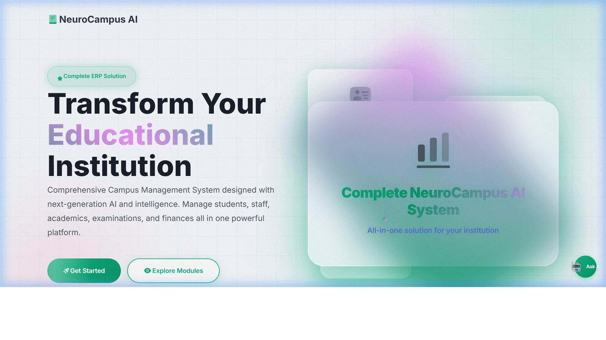
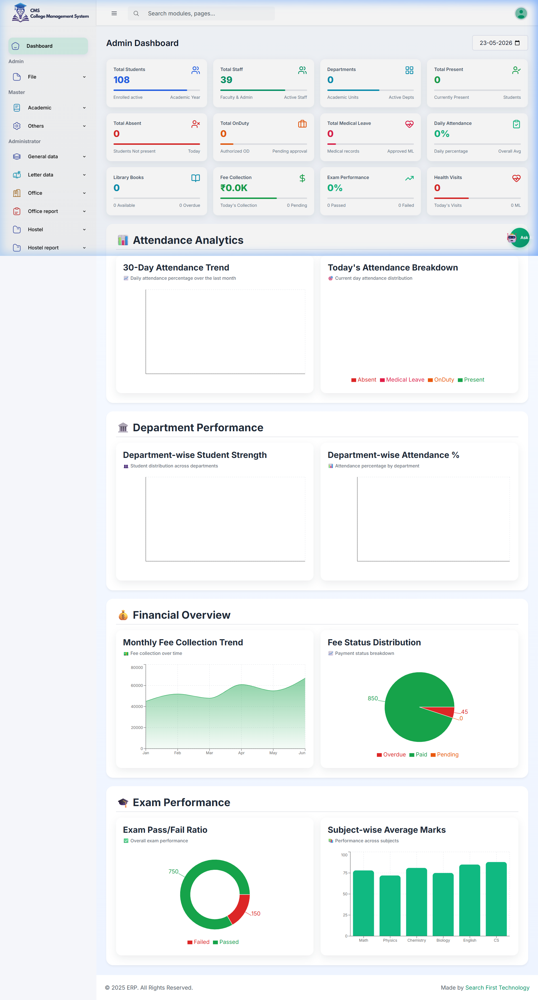
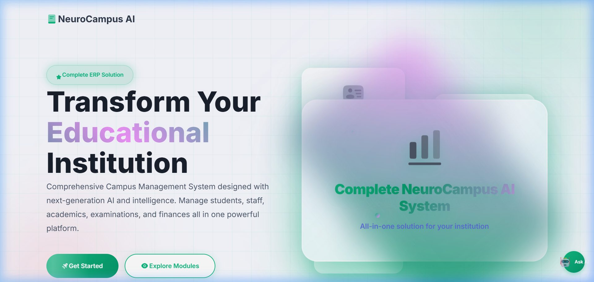
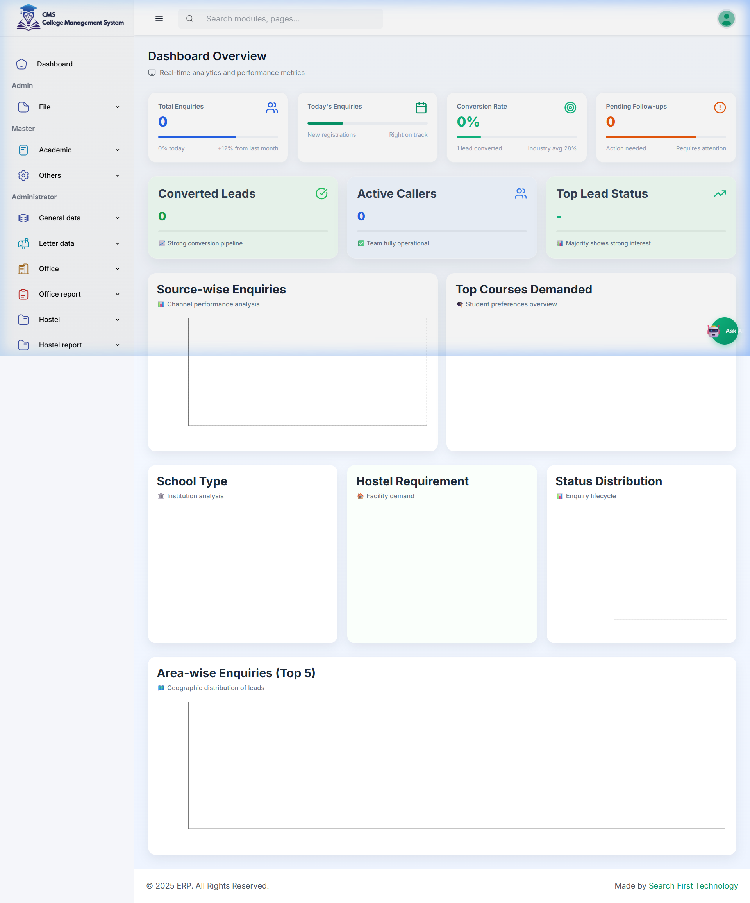
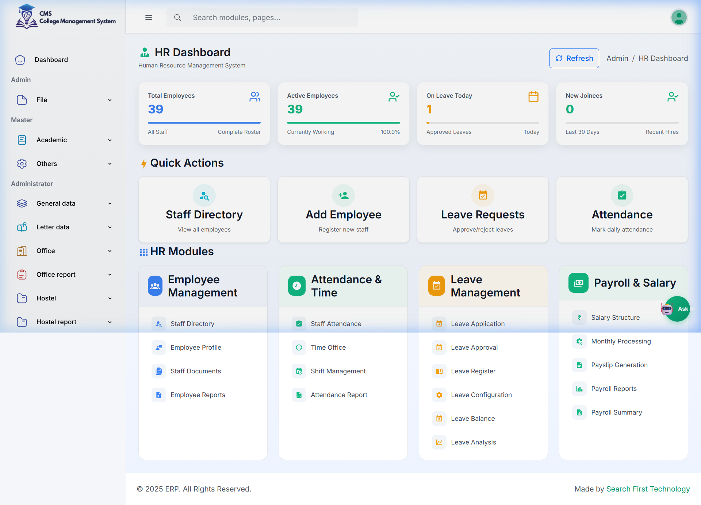

<div align="center">

<!-- Banner -->


<br/>

[](LICENSE)
[](https://nodejs.org/)
[](https://react.dev/)
[](https://mongodb.com/)
[](https://expressjs.com/)
[](https://docker.com/)
[]()

<br/>

> **🚀 Built for [Berrywise.ai](https://berrywise.ai) Round 2 Evaluation**  
> *Demonstrating AI-native engineering, full-stack mastery, and production-grade SaaS architecture*

</div>

---

## Why This Project Stands Out

NeuroCampus AI is positioned as a production-minded, AI-native campus operations platform rather than a demo CRUD app. It combines a real product surface area, a structured RBAC model, deployment-oriented Docker assets, and a documented AI-assisted engineering workflow into a repository that reads like a startup-grade internal platform.

- AI-native engineering workflow centered on Jetro.ai for planning, prototyping, debugging, and documentation
- Enterprise SaaS framing with modular domain ownership across admissions, academics, HR, examinations, fees, and analytics
- Deployment-ready architecture with Docker, Nginx, JWT, rate limiting, and structured backend observability
- Recruiter-friendly documentation that highlights product thinking, operational maturity, and scalable system design
- End-to-end execution from frontend UX and dashboarding to backend APIs, persistence, and role-aware access control

---

## 📖 Table of Contents

- [🌟 Overview](#-overview)
- [Why This Project Stands Out](#why-this-project-stands-out)
- [🎥 Live Demo](#-live-demo)
- [🏗️ System Architecture](#️-system-architecture)
- [⚡ Tech Stack](#-tech-stack)
- [🤖 Built Using AI-Native Engineering Workflows with Jetro.ai](#-built-using-ai-native-engineering-workflows-with-jetroai)
- [✨ Feature Showcase](#-feature-showcase)
- [🔐 Authentication & RBAC](#-authentication--rbac)
- [🚀 Quick Start](#-quick-start)
- [🐳 Docker Deployment](#-docker-deployment)
- [🔒 Security Architecture](#-security-architecture)
- [📊 API Reference](#-api-reference)
- [🧪 Testing](#-testing)
- [📁 Project Structure](#-project-structure)
- [🛣️ Roadmap](#️-roadmap)
- [👨‍💻 Engineering Decisions](#-engineering-decisions)

---

## 🌟 Overview

**NeuroCampus AI** is a production-grade, AI-augmented Enterprise Resource Planning (ERP) system designed for higher educational institutions. Built on the MERN stack with an AI-first development workflow, it serves as a comprehensive platform covering the full lifecycle of campus operations — from student admissions to examination management, attendance tracking, fee collection, and institutional analytics.

### Why NeuroCampus AI?

| Traditional ERP | NeuroCampus AI |
|---|---|
| Monolithic, tightly-coupled | Modular, loosely-coupled MERN architecture |
| Manual reports & dashboards | Real-time analytics with AI-generated insights |
| Fixed role-based access | Granular, dynamic RBAC with module-level permissions |
| No AI integration | AI Chat assistant embedded per-module |
| Expensive enterprise licenses | Open-source, self-hostable |
| Weeks to onboard | Seed → Demo-ready in minutes |

---

## 🎥 Live Demo

### Demo Preview



*Animated preview assembled from the existing landing page, admin dashboard, enquiry dashboard, and HR dashboard screenshots.*

### Admin Dashboard — Full Feature Walkthrough



*Admin Dashboard showing real-time KPI metrics: 108 enrolled students, 39 staff, live fee collection charts, attendance analytics, and department performance breakdowns.*

### Landing Page — NeuroCampus AI



*Emerald green branded landing page with glassmorphism cards and smooth gradient animations.*

### Enquiry Management Module



*Student enquiry pipeline with status tracking, conversion funnels, and follow-up management.*

### HR & Staff Management



*Staff management module with designation tracking, department allocation, and performance metrics.*

---

### Demo Access

The repository includes a seeded demo workflow for local evaluation, but credentials are intentionally not embedded in the public documentation. Use the seed and maintenance scripts in `server/scripts/` to provision test identities in your own environment, then authenticate through the configured login flow.

For a safe public README, the evaluation flow should be described as:

- Deploy the stack with the documented Docker or local setup
- Run the database seed and demo provisioning scripts in your private environment
- Sign in with the locally provisioned demo identities
- Review the admin, HR, enquiry, and student dashboards through the recorded preview above

---

## 🏗️ System Architecture

```
┌─────────────────────────────────────────────────────────────────────────────┐
│                          NeuroCampus AI — System Architecture                │
└─────────────────────────────────────────────────────────────────────────────┘

  ┌──────────────────────────┐          ┌──────────────────────────┐
  │    React 18 SPA (Vite)   │  REST    │   Express.js API Server  │
  │  ├── React Router v6     │◄────────►│  ├── Helmet.js (CSP)     │
  │  ├── Context API (Auth)  │   JWT    │  ├── Rate Limiter        │
  │  ├── Bootstrap 5 + CSS   │  Bearer  │  ├── Winston Logger      │
  │  ├── Iconify Icons       │          │  ├── Multer (Uploads)    │
  │  └── AI Chat Component   │          │  └── CORS + Compression  │
  └──────────┬───────────────┘          └──────────┬───────────────┘
             │                                      │
             │     Vite Proxy /api → backend API    │
             │◄─────────────────────────────────────┤
             │                                      │
             │                              ┌───────▼────────┐
             │                              │   MongoDB 7.x  │
             │                              │  ├── users      │
             │                              │  ├── students   │
             │                              │  ├── roles      │
             │                              │  ├── attendance │
             │                              │  ├── fees       │
             │                              │  └── 30+ more  │
             │                              └────────────────┘
             │
  ┌──────────▼───────────────────────────────────┐
  │              Module Layers                    │
  │  Admissions → Attendance → Exams → Certs      │
  │  HR → Library → Hostel → Finance → Reports   │
  └───────────────────────────────────────────────┘
```

### Request Lifecycle

```
Client Request
    │
    ├── Vite Dev Proxy (/api → backend API)
    │         OR
    │   Nginx Reverse Proxy (Production)
    │
    ▼
Express Router
    │
    ├── Rate Limiter (1000 req/min per IP)
    ├── Helmet.js Security Headers
    ├── CORS Validation
    ├── JWT Authentication Middleware
    ├── Role + Module Permission Check
    │
    ▼
Controller Layer
    │
    ├── Input Validation (express-validator)
    ├── Business Logic
    ├── Mongoose ORM Query
    │
    ▼
MongoDB Response → JSON → Client
```

---

## ⚡ Tech Stack

### Frontend
| Technology | Version | Purpose |
|-----------|---------|---------|
| React | 18.3 | UI framework, hooks-based SPA |
| Vite | 5.x | Build tool, HMR dev server |
| React Router | 6.x | Client-side routing |
| Bootstrap | 5.3 | Responsive grid + components |
| Iconify | Latest | 200k+ icon library |
| Recharts / Chart.js | Latest | Data visualization |

### Backend
| Technology | Version | Purpose |
|-----------|---------|---------|
| Node.js | 20.x | JavaScript runtime |
| Express.js | 4.21 | HTTP server framework |
| Mongoose | 8.x | MongoDB ODM |
| bcryptjs | 2.4 | Password hashing |
| jsonwebtoken | 9.x | JWT auth tokens |
| Helmet.js | 8.x | Security headers |
| Multer | Latest | File uploads |
| Winston | 3.x | Structured JSON logging |
| express-rate-limit | 7.x | DDoS protection |

### Database & DevOps
| Technology | Purpose |
|-----------|---------|
| MongoDB 7.x | Primary database — flexible schema for ERP domains |
| Docker | Containerized deployments (Dockerfile.prod included) |
| Docker Compose | Multi-service orchestration |
| dotenv | Environment variable management |
| nodemon | Hot-reload development |

---

## 🤖 Built Using AI-Native Engineering Workflows with Jetro.ai

NeuroCampus AI was built using an **AI-first development methodology**, with [Jetro.ai](https://jetro.ai) acting as the orchestration layer for architecture design, implementation iteration, and documentation. The point was not to use AI as decoration. The point was to compress the product-to-code cycle, keep the architecture coherent, and move quickly without losing engineering discipline.

### How Jetro.ai Accelerated Development

Jetro.ai helped compress the delivery cycle across planning, implementation, verification, and documentation:

- Architecture planning: mapped module boundaries, request flows, data ownership, and dependency chains before implementation
- Rapid prototyping: turned product ideas into implementable UI and backend slices without losing system consistency
- Iteration speed: shortened the gap between design changes, code edits, and validation by keeping the workflow tightly looped
- Debugging support: helped reason about auth flows, data-shape mismatches, and multi-module behavior
- Documentation generation: produced structured README and project narrative drafts that were then refined into release-grade documentation
- Verification support: assisted with browser-based validation and the capture of representative product states for the README

```
┌────────────────────────────────────────────────────┐
│              AI-Native Dev Lifecycle                │
│                                                     │
│  1. PLANNING          → Jetro.ai canvas for arch   │
│  2. CODE GENERATION   → AI-assisted module skels   │
│  3. DB SEEDING        → AI-generated seed scripts  │
│  4. DEBUGGING         → AI-driven error diagnosis  │
│  5. REFACTORING       → AI bulk theme migration    │
│  6. DOCUMENTATION     → AI-generated README        │
│  7. VERIFICATION      → AI browser testing agent   │
└────────────────────────────────────────────────────┘
```

#### 1. Architecture Planning on Infinite Canvas
Used Jetro.ai's infinite canvas to define the system before implementation: module boundaries, request choreography, data ownership, and operational dependencies were mapped up front so the codebase could scale by design rather than by accident.

#### 2. Automated Theme Refactoring (30+ Files)
Generated a custom recursive Node.js script via AI to scan JSX/CSS files and replace hardcoded purple/indigo values with the emerald green design system, updating **30+ components** in one pass:

```javascript
// AI-generated refactoring script — updateThemeAndBranding.js
// Recursively scanned /client/src/ and replaced:
// #667eea → #10B981  (indigo → emerald)
// #764ba2 → #059669  (purple → green-600)
// rgba(102, 126, 234, ...) → rgba(16, 185, 129, ...)
```

#### 3. AI-Assisted Database Credential Investigation
When the seeded identity model needed validation, AI-assisted inspection helped reason about the MongoDB collections and confirm the auth paths:
```bash
# AI-orchestrated database inspection and seed verification
node findUsers.js
node fixAdminPasswords.js
# Result: seeded identities and auth paths verified in a private environment
```

#### 4. Live Browser Verification Agent
Deployed a Jetro.ai browser subagent to validate the UI end to end:
- Navigate through the login surface in the evaluation environment
- Execute the admin login flow from credential entry to dashboard rendering
- Traverse the admin, HR, and enquiry modules to confirm access control and layout stability
- Validate the student journey with the seeded identity path and dashboard state

#### 5. Iteration Efficiency
The practical value of the AI-native workflow was faster convergence:
- fewer manual round trips between idea, implementation, and review
- faster refactoring of cross-cutting design changes
- tighter feedback on auth, routing, and dashboard behavior
- cleaner documentation because the system was documented while it was being built

#### 6. Structured JSON Logging Architecture
AI-designed Winston logging schema for production observability and operational debugging:
```json
{
  "timestamp": "2026-05-23T16:59:01.031Z",
  "level": "info",
  "message": "✅ MongoDB Connected",
  "service": "neurocampus-ai-backend",
  "environment": "development",
  "host": "127.0.0.1",
  "database": "cms_db",
  "latency": 324
}
```

---

## ✨ Feature Showcase

### 🎓 Academic Management
- **Department & Subject Master** — Hierarchical course/regulation/semester management
- **Class Allocation** — Subject-to-faculty mapping per semester
- **Timetable Management** — Period-wise schedule builder with conflict detection
- **Academic Calendar** — Institution-wide event and holiday management

### 📋 Admissions & Applications
- **Student Enquiry Pipeline** — Lead capture → follow-up → conversion tracking
- **Application Issue & Processing** — Quota-wise seat allocation (NRI, Management, Government)
- **Admitted Student Portal** — Profile photo upload, verification, status management
- **Admission Reports** — Ranking, course-wise stats, general forms export

### 📊 Attendance & Analytics
- **Daily Attendance Marking** — Period-wise attendance with OD/ML/Absent categories
- **Spell Attendance** — Cumulative attendance aggregation per term
- **Attendance Reports** — Student-wise, class-wise, department-wise drill-down
- **30-Day Trend Charts** — Real-time attendance visualizations

### 📝 Examination System
- **Exam Configuration** — Hall/seat generation, nominal roll creation
- **Digital Numbering** — Automated answer script numbering
- **Data Submission** — QP requirement, strength list, exam fee processing
- **Result Processing** — Mark entry → pass/fail computation → result publication
- **Arrear Management** — Ex2 present/absent tracking

### 📜 Certificates & Documents
- **Transfer Certificate (TC)** — Generation with automated serial numbering
- **Bonafide Certificate** — Template-based generation per student
- **Course Completion** — Achievement certificates
- **Conduct Certificate** — Behavioral certification
- **Fee Estimation Letter** — Financial documentation

### 💰 Fee Management
- **Fee Master** — Configurable fee heads per course/regulation
- **Fee Collection** — Payment recording with receipt generation
- **Overdue Tracking** — Automated follow-up on pending payments
- **Financial Reports** — Collection trends, category-wise breakdowns

### 🏨 Hostel Management
- **Room Allocation** — Bed/room assignment with occupancy tracking
- **Hostel Reports** — Strength, vacant rooms, fee status

### 👥 HR & Staff Management
- **Staff Profile Management** — Designation, department, qualification tracking
- **Designation Master** — Hierarchical org structure
- **Leave Management** — Leave request, approval, balance tracking

### 🎒 Student Portal (Role: Student)
- **Personal Dashboard** — Profile, academic year overview
- **Attendance Viewer** — Subject-wise, cumulative attendance
- **Mark Details** — Unit test, assignment, practical marks
- **Certificate Requests** — Self-service document requests

---

## 🔐 Authentication & RBAC

### Multi-Role Authentication Flow

```
POST /api/auth/login
  ├── Body: { username, password, role }
  ├── Student Auth Path:
  │     └── Query students collection by registerNumber
  │         └── Plain-text compare (legacy) OR bcrypt fallback
  │         └── Return JWT + student profile
  └── Staff/Admin Auth Path:
        └── Query users collection by username
            └── Role validation → bcrypt.compare(password, hash)
            └── Return JWT + module_access string
```

### Module-Level Permission System

Each user carries a `module_access` CSV string encoding exact module permissions:
```
"dashboard,Attendance_DailyAttendance,Assessment_UnitTestMarkEntry,
Exam Process_ExamGeneration,Data Submission_NominalRoll,..."
```

The frontend sidebar dynamically renders only authorized modules:
```javascript
// Permission check in Sidebar.jsx
const hasAccess = (moduleKey) => {
  return user?.module_access?.includes(moduleKey) || user?.role === 'Admin';
};
```

### JWT Token Architecture

```javascript
// Token payload structure
{
  user_id: ObjectId,
  username: "<demo-username>",
  role_id: ObjectId,
  role_name: "<role>",
  staff_name: "<display-name>",
  module_access: "<module-permissions>",
  iat: timestamp,
  exp: iat + 24h
}
```

---

## 🚀 Quick Start

### Prerequisites
- Node.js 20+ 
- MongoDB 7.x or a compatible managed MongoDB deployment
- npm 9+

### 1. Clone & Install

```bash
git clone https://github.com/prawinkumar2k/ai-campus-erp.git
cd ai-campus-erp

# Install all dependencies (root + client + server)
npm install
cd client && npm install && cd ..
cd server && npm install && cd ..
```

### 2. Environment Configuration

```bash
# server/.env
MONGO_URI=mongodb://<host>:27017/cms_db
JWT_SECRET=your-super-secret-jwt-key-change-in-production
JWT_EXPIRES_IN=24h
PORT=5000
NODE_ENV=development
RATE_LIMIT_WINDOW_MS=60000
RATE_LIMIT_MAX_REQUESTS=1000
```

### 3. Seed Database

```bash
cd server

# Seed initial data for your private environment
node scripts/seedDatabase.js

# Optional: align local demo identities with your evaluation runbook
node scripts/fixAdminPasswords.js
```

### 4. Launch Development Servers

```bash
# Terminal 1 — Backend
cd server && npm run dev
# ✅ Server running on port 5000

# Terminal 2 — Frontend
cd client && npm run dev
# ✅ Vite dev server available on the configured local host
```

### 5. Login

Navigate to the app's login surface in your local or deployed environment and authenticate using the demo identities provisioned by your private seed process.

---

## 🐳 Docker Deployment

### Development with Docker Compose

```yaml
# docker-compose.yml
version: '3.8'
services:
  mongodb:
    image: mongo:7
    ports:
      - "27017:27017"
    volumes:
      - mongo_data:/data/db

  backend:
    build: ./server
    ports:
      - "5000:5000"
    environment:
      - MONGO_URI=mongodb://mongodb:27017/cms_db
      - JWT_SECRET=production-secret
    depends_on:
      - mongodb

  frontend:
    build:
      context: ./client
      dockerfile: Dockerfile.prod
    ports:
      - "80:80"
    depends_on:
      - backend

volumes:
  mongo_data:
```

```bash
# Launch full stack
docker-compose up --build -d

# Seed database in container
docker exec -it neurocampus-backend node scripts/seedDatabase.js
```

### Production Dockerfile (Client)

```dockerfile
# client/Dockerfile.prod
FROM node:20-alpine AS builder
WORKDIR /app
COPY package*.json ./
RUN npm ci --only=production
COPY . .
RUN npm run build

FROM nginx:alpine
COPY --from=builder /app/dist /usr/share/nginx/html
COPY nginx.conf /etc/nginx/conf.d/default.conf
EXPOSE 80
CMD ["nginx", "-g", "daemon off;"]
```

---

## 🔒 Security Architecture

| Layer | Implementation |
|-------|---------------|
| **Transport** | HTTPS (production via Nginx SSL termination) |
| **Authentication** | JWT Bearer tokens, 24h expiry, secure httpOnly cookies |
| **Password Security** | bcryptjs with salt rounds = 10 |
| **Rate Limiting** | express-rate-limit: 1000 req/min per IP |
| **Security Headers** | Helmet.js: CSP, X-Frame-Options, HSTS, XSS-Protection |
| **CORS** | Whitelist-based origin validation |
| **Input Validation** | express-validator on all POST/PUT endpoints |
| **File Uploads** | Multer with mime-type validation, size limits |
| **Logging** | Winston structured JSON — all auth events logged |

---

## 📊 API Reference

### Authentication

```http
POST /api/auth/login
Content-Type: application/json

{
  "username": "<demo-username>",
  "password": "<demo-password>",
  "role": "Admin"
}

Response 200:
{
  "success": true,
  "token": "eyJhbGciOiJIUzI1NiIsInR5cCI6IkpXVCJ9...",
  "user": {
    "id": "...",
    "username": "<demo-username>",
    "staff_name": "<display-name>",
    "role_name": "Admin",
    "module_access": "<module-permissions>"
  }
}
```

```http
GET /api/auth/roles
Response: [{ "id": 1, "role": "Admin" }, { "id": 2, "role": "Student" }, ...]
```

```http
GET /api/auth/profile
Authorization: Bearer <token>
Response: { user profile object }
```

### Core Modules API

```
/api/academic/*         → Academic master data (departments, subjects, timetables)
/api/admissions/*       → Student admissions workflow
/api/attendance/*       → Attendance marking and reports
/api/assessment/*       → Mark entry (unit test, assignment, practical)
/api/exam/*             → Examination management
/api/certificates/*     → Document generation
/api/fees/*             → Fee collection and tracking
/api/hr/*               → Staff and HR management
/api/hostel/*           → Hostel management
/api/students/*         → Student CRUD and profiles
```

---

## 🧪 Testing

### API Testing with PowerShell

```powershell
# Test admin login
$body = @{username='<demo-username>';password='<demo-password>';role='Admin'} | ConvertTo-Json
Invoke-WebRequest -Uri $env:NC_API_URL `
  -Method POST -ContentType 'application/json' -Body $body `
  -UseBasicParsing | Select-Object -ExpandProperty Content

# Test roles endpoint
Invoke-WebRequest -Uri "$($env:NC_API_URL)/api/auth/roles" -UseBasicParsing | Select-Object Content

# Test student login
$body = @{username='<student-username>';password='<student-password>';role='Student'} | ConvertTo-Json
Invoke-WebRequest -Uri $env:NC_API_URL `
  -Method POST -ContentType 'application/json' -Body $body `
  -UseBasicParsing | Select-Object Content
```

### Database Health Check

```bash
# Verify all collections
node -e "
const mongoose = require('mongoose');
mongoose.connect(process.env.MONGO_URI || 'mongodb://<host>:27017/cms_db').then(async () => {
  const cols = await mongoose.connection.db.listCollections().toArray();
  console.log('Collections:', cols.map(c => c.name));
  process.exit(0);
});
"
```

---

## 📁 Project Structure

```
ai-campus-erp/
├── client/                          # React 18 SPA (Vite)
│   ├── src/
│   │   ├── components/
│   │   │   ├── css/
│   │   │   │   └── style.css        # Global CSS variables (emerald green system)
│   │   │   ├── Sidebar.jsx          # Dynamic RBAC-driven sidebar
│   │   │   ├── AIChat.jsx           # Embedded AI assistant
│   │   │   └── ...
│   │   ├── pages/
│   │   │   ├── HomePage.jsx         # Landing — NeuroCampus AI branding
│   │   │   ├── LoginPage.jsx        # Multi-role auth form
│   │   │   ├── admin/
│   │   │   │   ├── adminDashboard.jsx    # KPI dashboard + charts
│   │   │   │   ├── Attendance/           # Attendance modules
│   │   │   │   ├── Academic/             # Academic modules
│   │   │   │   ├── Examination/          # Exam modules
│   │   │   │   ├── HR/                   # HR modules
│   │   │   │   └── ...
│   │   │   └── student/
│   │   │       ├── StudentDashboard.jsx
│   │   │       ├── Attendance.jsx
│   │   │       └── MarkDetails.jsx
│   │   ├── context/
│   │   │   └── AuthContext.jsx      # JWT token management
│   │   └── main.jsx
│   ├── Dockerfile.prod              # Production Docker image
│   └── vite.config.js               # Vite + proxy config
│
├── server/                          # Express.js API
│   ├── config/
│   │   └── db.js                   # Mongoose connection + retry logic
│   ├── controller/
│   │   ├── authController.js        # Login, JWT issuance, role validation
│   │   └── ...                      # Module controllers
│   ├── models/                      # Mongoose schemas
│   │   ├── User.js
│   │   ├── Student.js
│   │   ├── Role.js
│   │   └── ...
│   ├── routes/                      # Express route handlers
│   ├── middleware/
│   │   ├── auth.js                  # JWT verification middleware
│   │   └── upload.js                # Multer file handling
│   ├── scripts/
│   │   ├── seedDatabase.js          # Initial data seeding
│   │   ├── fixAdminPasswords.js     # Demo provisioning utility
│   │   └── findUsers.js             # Private database inspection helper
│   ├── app.js                       # Express app factory
│   ├── server.js                    # Entry point
│   └── .env                         # Environment variables
│
├── docs/
│   └── screenshots/                 # UI screenshots for README
├── docker-compose.yml
└── README.md
```

---

## 🛣️ Roadmap

### Phase 1 — Core ERP (✅ Complete)
- [x] Multi-role authentication with JWT
- [x] Dynamic RBAC sidebar with module-level permissions
- [x] Student & Staff management
- [x] Attendance marking and reports
- [x] Examination management (full cycle)
- [x] Certificate generation
- [x] Fee collection module
- [x] Admin analytics dashboard with charts

### Phase 2 — AI Integration (🔄 In Progress)
- [x] Embedded AI Chat assistant component
- [ ] AI-powered attendance anomaly detection
- [ ] Natural language query interface for reports
- [ ] Predictive fee defaulter identification
- [ ] AI-generated academic insights

### Phase 3 — Production Hardening (📋 Planned)
- [ ] Redis caching layer for hot-path queries
- [ ] S3/GCS file storage (replace local Multer)
- [ ] CI/CD pipeline (GitHub Actions → container registry)
- [ ] Grafana + Prometheus monitoring
- [ ] End-to-end tests with Playwright
- [ ] WebSocket real-time notifications

### Phase 4 — Scale (🔮 Future)
- [ ] Multi-tenant architecture (institution isolation)
- [ ] Mobile app (React Native)
- [ ] Offline-first PWA capability
- [ ] Data export to national portals (TNPSC/NAAC format)

---

## 👨‍💻 Engineering Decisions

### Why MongoDB over PostgreSQL?
ERP systems in education have **highly variable schemas** across institutions — department structures, exam configurations, fee heads, and certificate templates differ per college. MongoDB's flexible document model allows rapid schema iteration without migration overhead. Mongoose provides schema enforcement where structure is known, while allowing extension fields where flexibility is needed.

### Why React Context API over Redux?
For this scale (single-institution ERP), React Context + `useReducer` provides sufficient state management without the boilerplate overhead of Redux. The `AuthContext` manages JWT tokens, user profile, and module permissions — the primary shared state concern. Module-specific state is co-located with components.

### Why Vite over CRA?
Vite's ES module-native dev server provides **10-50x faster** HMR compared to webpack-based CRA. For a codebase with 100+ components, this translates to near-instant hot reloads during development.

### JWT vs Session-Based Auth
Stateless JWT tokens were chosen to enable future **horizontal scaling** — any server instance can validate a token without shared session storage. The 24h expiry + refresh token pattern provides security without constant re-authentication.

### Emerald Green Design System
The global CSS variable system (`--primary-50` through `--primary-900`) using HSL-calibrated emerald green values ensures **design consistency** across 100+ components. The AI-driven bulk refactoring script updated all hardcoded hex values in a single automated pass.

---

## 👤 Author

<div align="center">

**Prawin Kumar N**  
Full-Stack Engineer | AI-Native Developer

[](https://github.com/prawinkumar2k)

*Built with a production-first MERN stack and Jetro.ai-powered AI-native engineering workflows*

</div>

---

<div align="center">


**NeuroCampus AI** — *Transforming Campus Management with Intelligence*

</div>

